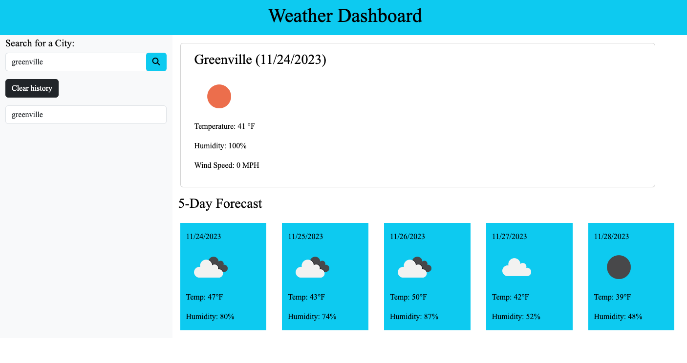

# Server-Side APIs: Weather Dashboard

## Description
A website that displays the weather for the current day and the next five days, for the location of your choice.

## Installation
link to deployed application:

## Usage
The user inputs a city name into the search field and clicks the search button.

The app recieves the weather data from the API and processes it. The processed data displays a five day weather forecast.

A record is kept in local storage of the user’s search history & is displayed on page. 

